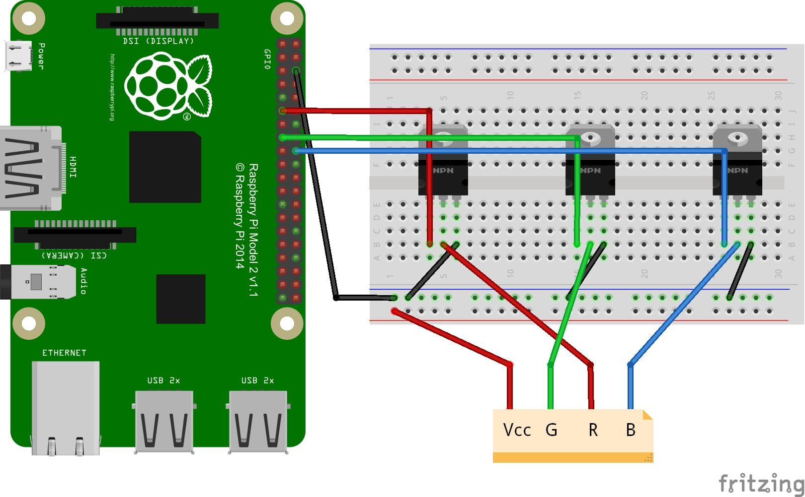
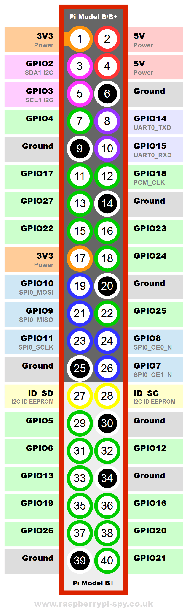

# Hardware Installation
## Introduction
This document is a guide to install and control an LED strip with a RaspberryPI.  
To do this, I followed this tutorial: https://dordnung.de/raspberrypi-ledstrip/  
## Components
> 1x RPI 2 B  
> 1x LED Strip SMD5050 12V DC 5m 60LEDs/m  
> 3x MOFSET N (IRFZ44N 518P WS)  
> 1x 12V 5A power supply  
> 1x Power jack (compatible with PSU)  
> Xx jumper wires male-male  
> Xx jumper wires male-female  
> 1x breadboard  
### Side notes
The power supply must be chosen according to the amount of LEDs it will be powering and according to the brightness that you want. Here, I chose a 5A because I wanted to use about half of the strip (~2.5m) and I wanted it to be as bright as possible.  
These components are used for testing the circuit. For definitive installation, get rid of the breadboard and jumper wires and solder actual cables. Also I would advise to find some sort of box to get everything kept together.  
## Wiring

### Mosfets
When looking at the MOSFET from the front (where the text is):    
> the first pin from the left is the Gate pin  
> the second pin is the Drain pin  
> the third pin is the Source pin  

The source pins go to the ground, the drain goes to the LED strip and the gate goes to the RPI.  

### Raspberry PI GPIOs
The GPIO pins used here are:  
> GPIO17 for red  
> GPIO22 for green  
> GPIO24 for blue  

Here’s the pin description of the Raspberry PIs GPIO pins:  
